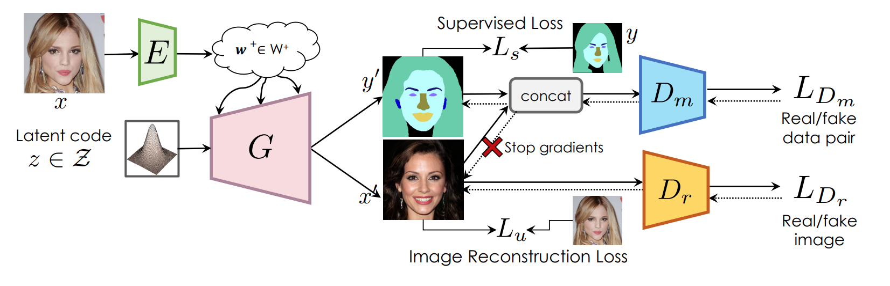

# SemanticGAN
Reproduced by Megha and Snigdha (also tried for different datasets)

#### Semantic Segmentation with Generative Models: Semi-Supervised Learning and Strong Out-of-Domain Generalization

Authors of the paper: [Daiqing Li](https://scholar.google.ca/citations?user=8q2ISMIAAAAJ&hl=en), [Junlin Yang](https://scholar.google.com/citations?user=QYkscc4AAAAJ&hl=en), [Karsten Kreis](https://scholar.google.de/citations?user=rFd-DiAAAAAJ&hl=de), [Antonio Torralba](https://groups.csail.mit.edu/vision/torralbalab/), [Sanja Fidler](http://www.cs.toronto.edu/~fidler/)

CVPR 2021 **[[Paper](https://arxiv.org/abs/2104.05833)]  [[Supp](https://nv-tlabs.github.io/semanticGAN/resources/SemanticGAN_supp.pdf)] [[Page](https://nv-tlabs.github.io/semanticGAN/)]** 




## Requirements
- Python 3.6 or 3.7 are supported.
- Pytorch 1.4.0 + is recommended.
- This code is tested with CUDA 10.2 toolkit and CuDNN 7.5.
- Please check the python package requirement from [`requirements.txt`](requirements.txt), and install using
```
pip install -r requirements.txt
```
## Dataset
1. CelebA 
2. Hough Transform Barcode Dataset
3. IDD
## Training 

To reproduce paper **Semantic Segmentation with Generative Models: Semi-Supervised Learning and Strong Out-of-Domain Generalization**: 

1. Run **Step1: Semantic GAN training**
2. Run **Step2: Encoder training**
3. Run **Inference & Optimization**.  


---
#### 0. Prepare for FID calculation
In order to calculate FID score, you need to prepare inception features for your dataset,

```
python3 extractfeature.py 
```

Remember to change the path to dataset in extractfeature.py

#### 1. GAN Training

For training GAN with both image and its label,

Below use the pickle generated above for GAN training.

```
python train_seg_gan.py \
--img_dataset [path-to-img-folder] \
--seg_dataset [path-to-seg-folder] \
--inception [path-to-inception file] \
--seg_name celeba-mask \
--checkpoint_dir [path-to-ckpt-dir] \
```

To use multi-gpus training in the cloud,

```
python -m torch.distributed.launch \
--nproc_per_node=N_GPU \
--master_port=PORTtrain_gan.py \
train_gan.py \
--img_dataset [path-to-img-folder] \
--inception [path-to-inception file] \
--dataset_name celeba-mask \
--checkpoint_dir [path-to-ckpt-dir] \
```

#### 2. Encoder Triaining

```
python train_enc.py \
--img_dataset [path-to-img-folder] \
--seg_dataset [path-to-seg-folder] \
--ckpt [path-to-pretrained GAN model] \
--seg_name celeba-mask \
--enc_backbone [fpn|res] \
--checkpoint_dir [path-to-ckpt-dir] \
```


